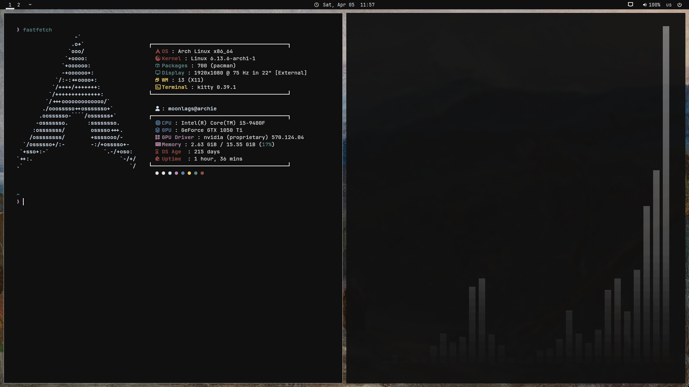

# dotfiles

simple black rice for i3

### showcases 




### packages
```bash
pacman -S firefox dunst udiskie i3 neovim git ripgrep zsh fzf rofi maim xclip polybar ttf-jetbrains-mono-nerd stow picom kitty feh fastfetch unzip fd xorg redshift xautolock lf
```

### Install with stow:
```bash
stow .
```
